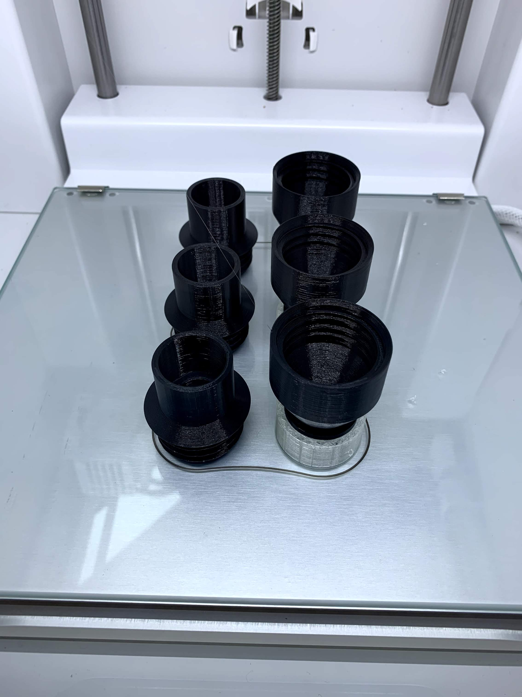

**THIS VERSION IS OUT OF DATE. PLEASE DO NOT USE.**

# Mount Sinai Health System Split Ventilator Prototyping
Version 1.2

Here, we are making available two simple-to-print flow adapters (in folder [adapter](adapter)), together with a one-way check valve (in folder [check_valve](check_valve)). The check valve is a heavily modified version of an existing open source project, with original project documentation, [build instructions](https://youtu.be/sCIX3egYKQM), and [project files](https://cad.onshape.com/documents/5c996e71d2872726995198bf/w/40c80b6ee82124a954fda09d/e/5520dc2a611624c9350b6dc1) also publicly available. We thank these teams for their effort. 

## Basic Build Information
* Both sets of parts below should be printed in PLA with a layer height between 0.1 and 0.3mm. We encourage you to print at the largest layer height possible and checking for press-fit and thread compatibility for the adapter and check valve, respectively.
* Print with at least 3 perimeters and at least 3 top and bottom layers.
* Infill of 10-20% is more than sufficient for appropriate rigidity. 
* PLA including additives *should not be used*. Other materials can be considered. PETG seems a particularly good option for dimensional accuracy, though this has not yet been tested. ABS should not be used.
* Depending on your cooling capacity you may not require any supports, but your mileage may vary. `adapter_v1.2_smallMaleMale.stl` and `valve_v1.2_Female.stl` both include a 90 degree overhang when printed in the correct orientation. Setting the overhang angle to 75 degrees will eliminate unnecessary support structures being generated for threading in each of the valve components.
* Press-fit interfaces between adapters and valves should be lined with teflon tape.

These designs have been fit tested from prints on at least 6 commonly available FDM-style 3D printers, with good intra-printer reliability. For use, prints from the same printer should be paired. The entire set of files has been parameterized around the fit of the male interface to a commonly-available [3/4" brass sweat gate valve](https://www.homedepot.com/p/Everbilt-3-4-in-Brass-Sweat-x-Sweat-Gate-Valve-170-4-34-EB/308593230).

## Inner (Male-Male) and Outer (Female-Female) Flow Adapters
**NOTE 2020-03-30: *Please do not yet produce this part. It is likely that our gate valve will change due to regulatory requirements, so adapters must be modified or may become obsolete.***
* Files are `adapter_v1.2_largeFemaleFemale.stl` and `adapter_v1.2_smallMaleMale.stl`.
* Files should be printed in a vertical orientation, but are symmetric along this axis with a normal plane of symmetry, so either orientation is equivalent. 

## Two-Part One-Way Check Valve
* Files are `valve_v1.2_Female.stl` and `valve_v1.2_Male.stl`, and can be printed in ordinary PLA.
* Print orientation here *matters*. `valve_v1.2_Male.stl` must be printed with the threading down toward the build surface, preferably made of glass or other very smooth material. It is important that this interface is as smooth as possible.
* `valve_v1.2_Female.stl` should be printed with threads up, as this eliminates unnecessary support structures inside the thread cavity, requiring them only for the 90 degree overhang.
* Build instructions are now available as a [separate document](buildCheckValve.md).
* We include laser-cut plastic membrane [cut files](membrane) and [instructions](buildPlasticMembrane.md) as an assembly option, referenced in the build instructions for the check valve.

Appropriate orientation on the build plate is shown here.

