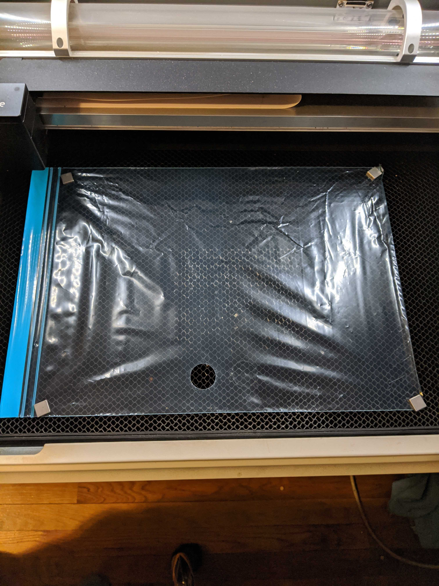

**NOTE 2020-04-01: *This process has only been validated on a Glowforge Basic laser cutter (40W CO2 laser); However, many of these parameters translate exactly to the corresponding parameters used by Epilog and Universal laser cutters (40W-60W range, CO2 lasers).***

## Build Instructions for Laser Cutting Plastic Bag Membrane

1. Load `plasticValveMembrane_v1.2.dxf` or `plasticValveMembrane_v1.2.svg` into the vector editing software of your choice.
2. Ensure the diameter of the larger circle is 1 in. Scale the drawing uniformly if needed.
3. Change the drawing fill, stroke width, and stroke color to ensure it is cut (not scored, etched, or rastered) on the laser cutting system being used.
4. Once the necessary drawing edits have been made, adjust the cutting parameters of the laser to the following:
    * Full speed
    * 35% - 45% of max power (lower percentage for higher powered lasers and vice versa)
    * Max frequency/PPI
5. Lay a standard plastic storage bad (sheet thickness ~0.0025in) flat on the laser cutter bed and hold taut with masking tape, pins, or magnets. See image below.
6. Ensure the laser cutter is properly focused and begin cutting.

