## Check Valve Build Instructions
### Bill of Materials
* Paired, 3D printed check valves
* Ziploc sandwich bags
* Short (<20mm) M3 screws
* PTFE (Teflon) tape
* Scisors
* Awl, or equivalent
* Allen wrenches (or appropriate  wrench for M3 screw above)

### Instructions

1. Prepare the male valve component for an M3 screw by using an awl or similar cylindrically-shaped tool to slightly widen the central screw socket.

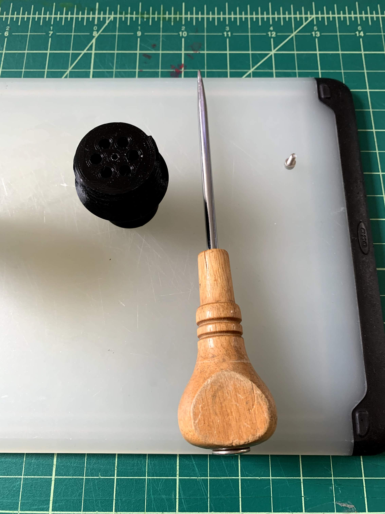

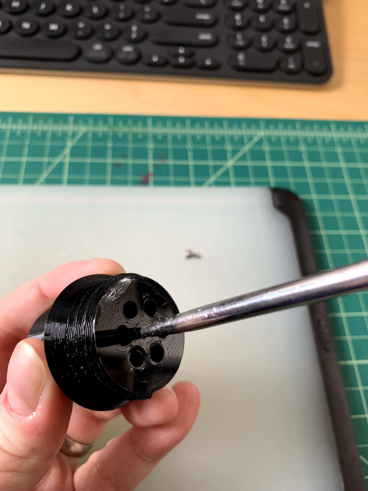

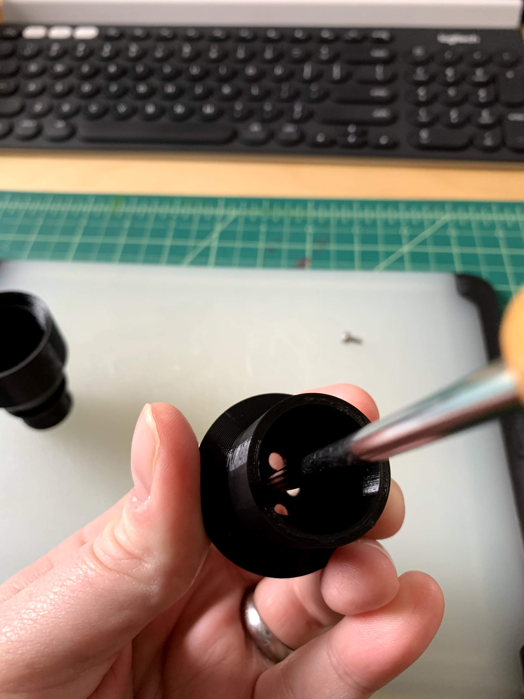

2. Using a standard Ziploc or equivalent sandwich bag, cut a single layer of plastic material large enough to entire cover the surface of the male valve component. Alternatively, you may use the optional laser-cut plastic membrane [cut files](membrane) and [instructions](buildPlasticMembrane.md) to create a precision membrane from standard Ziploc bags.

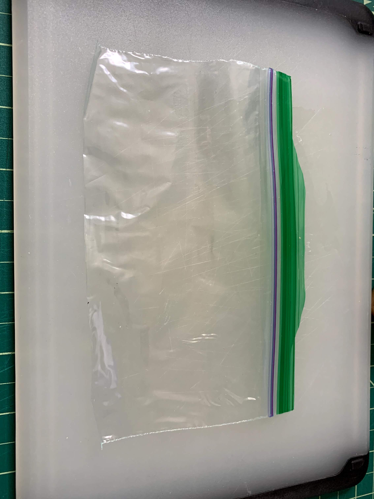

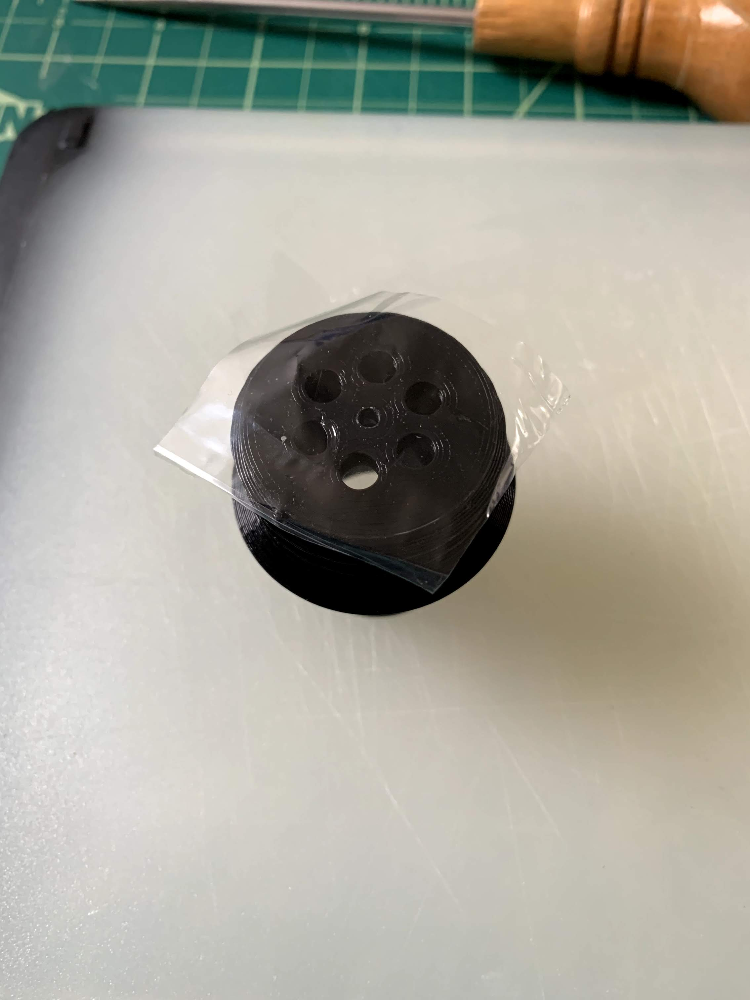

3. Using your awl or equivalent device (a  stab incision into the plastic will also work), create a hole in the center of the Ziploc plastic sheet through which the screw will be inserted. Ensure the size of the hole is at a minimum, no wider than the central screw socket on the component itself.

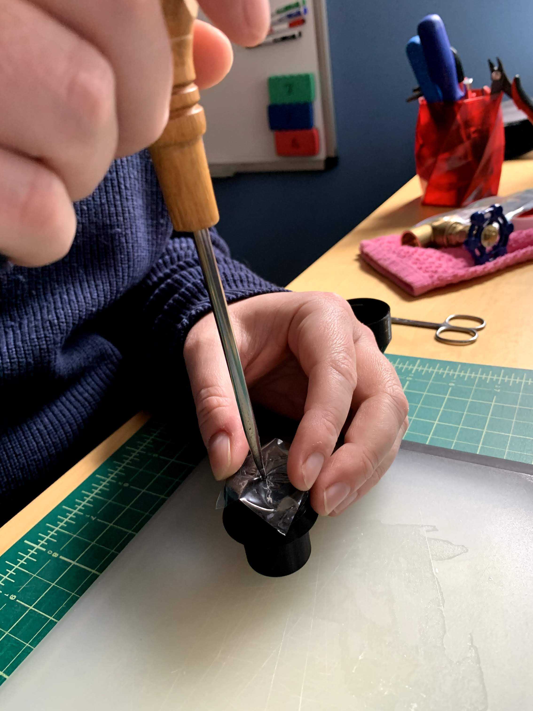

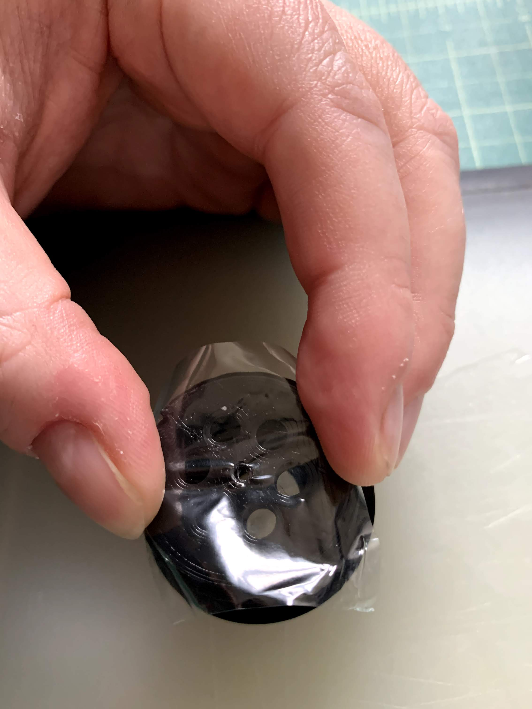

4. Insert the M3 screw, and using considerable downward pressure, screw it in flush and more than finger tight, using an appropriately sized allen (or other, depending on your M3 screw head configuration) wrench. If you find it is difficult to self-start and achieve purchase with the M3 screw, return to step 1 and widen the hole a bit more.

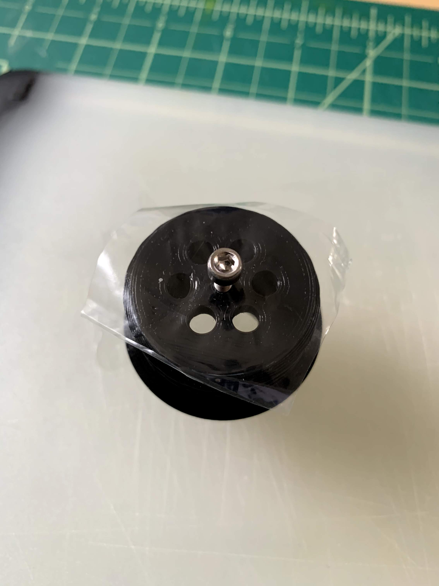

5. Trim the edges of the Ziploc plastic sheet so that it does not extend beyond the sides of the device.

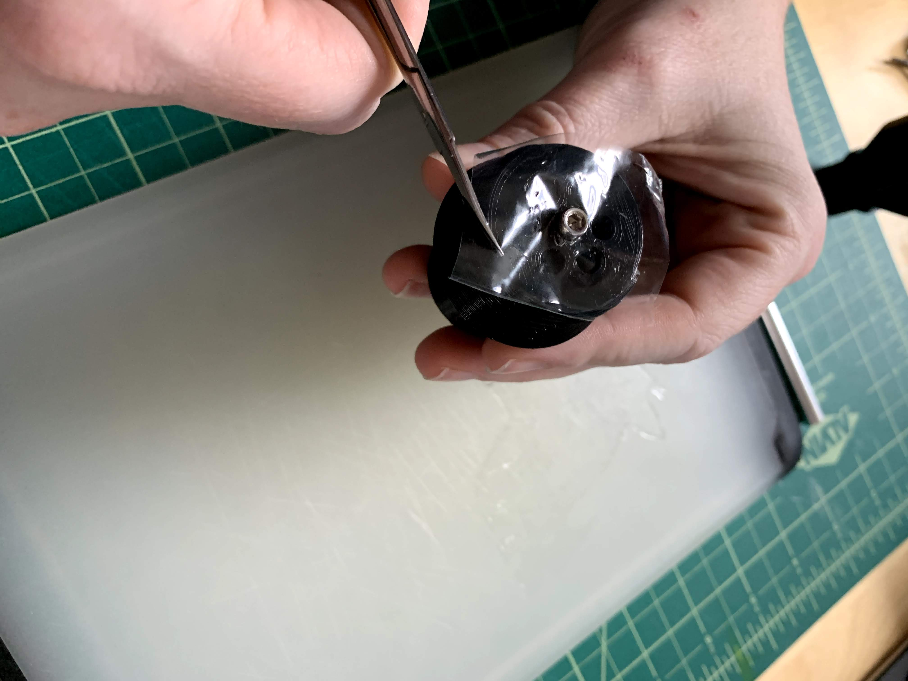

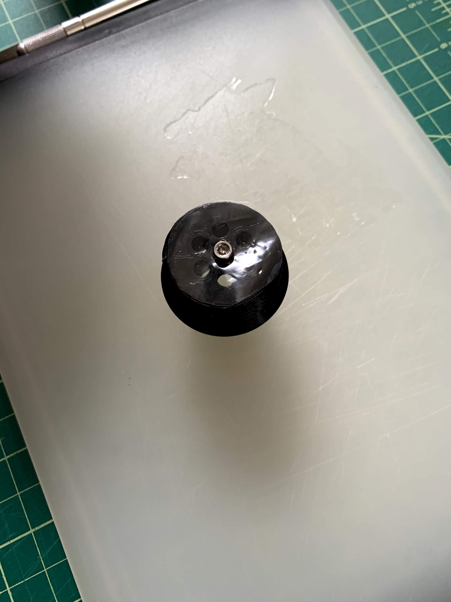

6. Finally, line the male screw threads in at least 2 layers of PTFE (Teflon) tape, and screw the device together, over hand tight.

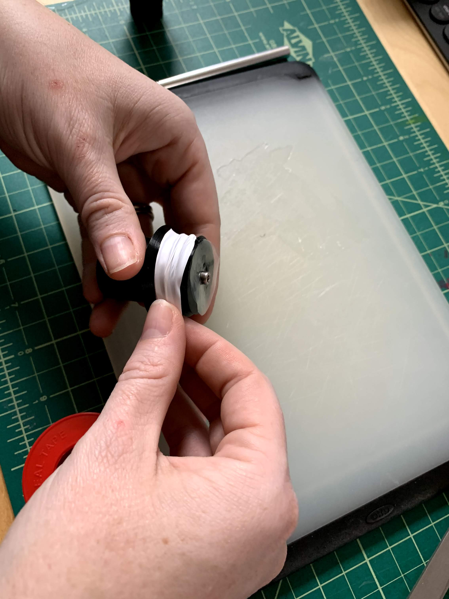

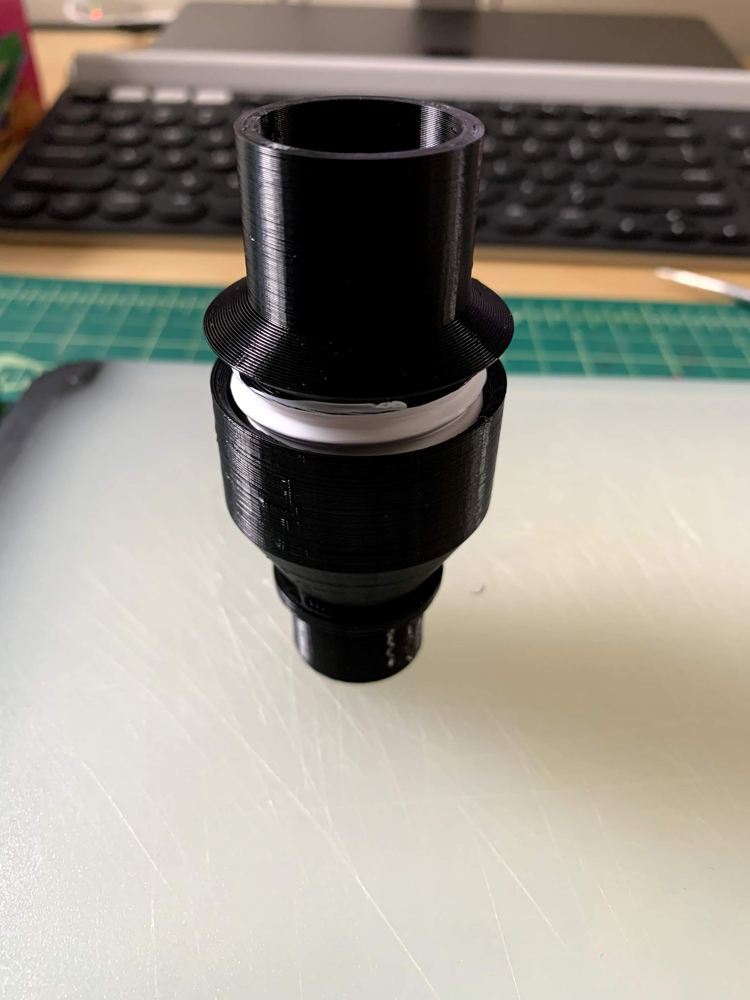

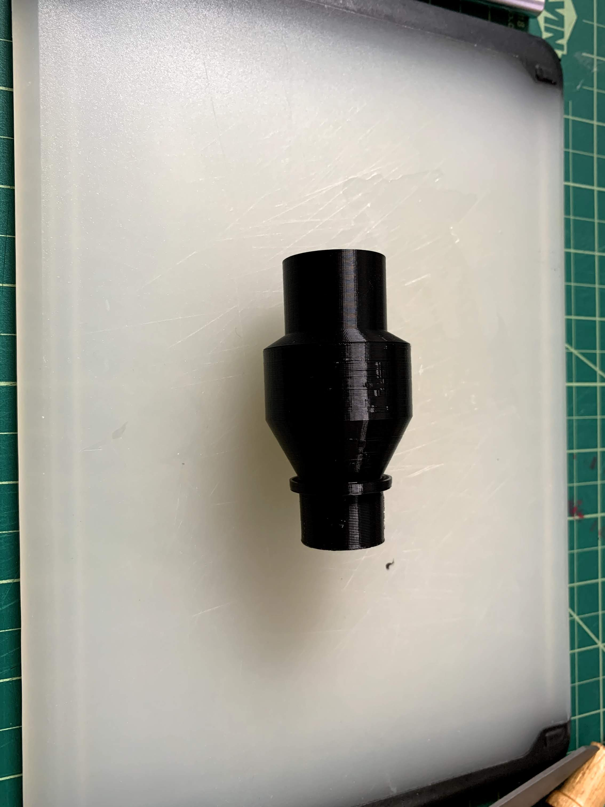

Congraulations! You've completed construction of the one-way check valve.
